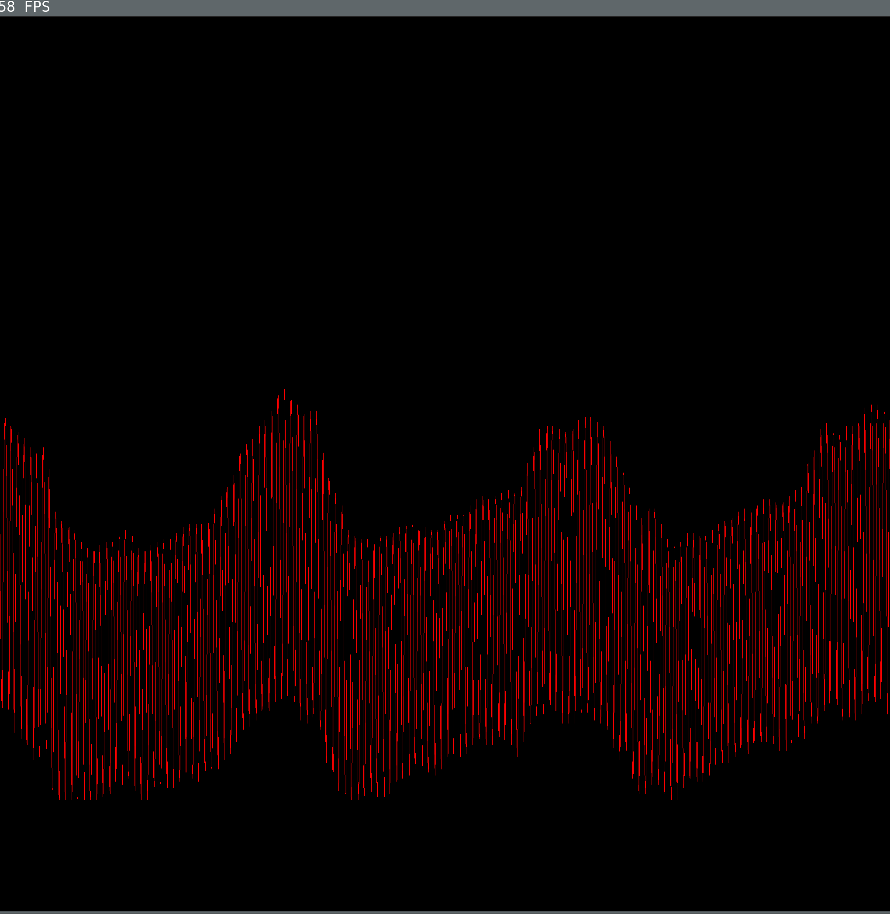
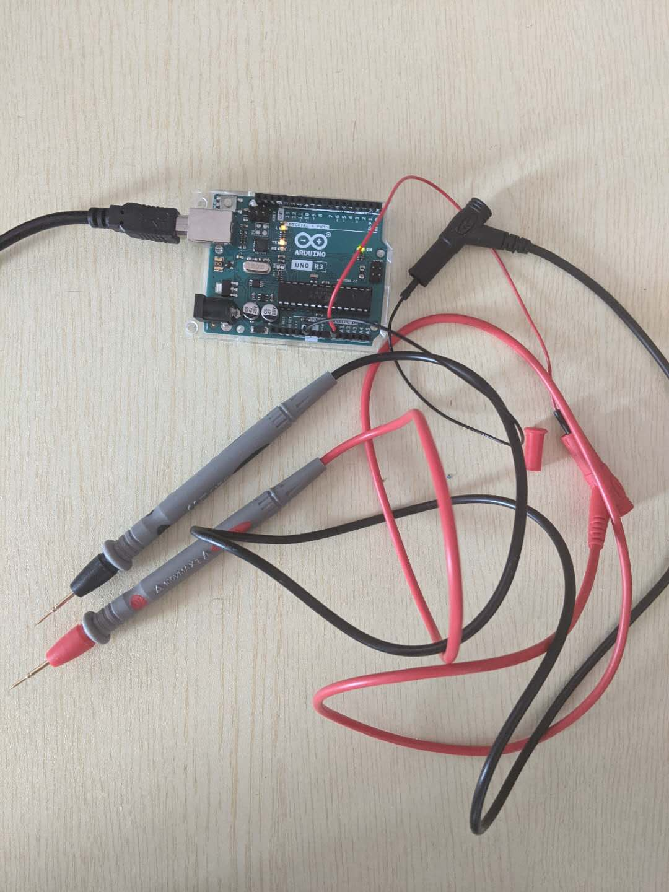

# Arduino Oscilloscope

Convert a $20 Arduino to a $200 Oscilloscope.

# Fancy photos

# Prerequisite

- An Arduino board(Tested on Arduino Uno R3)
- A modern Linux distro(Tested on Arch Linux Oct 2020)
- A g++ version(Tested on GCC 10.1) that support C++17, SDL2 library
- Python 3(Tested on 3.8.6), pyserial(Tested on pyserial==3.4)
- PlatformIO(To compile code and flash to Arduino)
- CLion(optional, it will make life easier)

# Build

- Build and flash the Arduino code using PlatformIO CLion plugins
- Compile the C++ files which is a SDL application to display the oscilloscope
  - `g++ -std=c++17 -o osc-sdl osc-sdl.cpp -lSDL2`

# Run

- Plug two wires(I use two probe pins from my multimeter) in Arduino ground pin and A0 pin
- Check the path your Arduino serial port. Ususally it's at `/dev/ttyACM0`
- `python3 osc-serial.py /dev/ttyACM0 | ./osc-sdl`
- Probe something that you are curious at with the two wire

